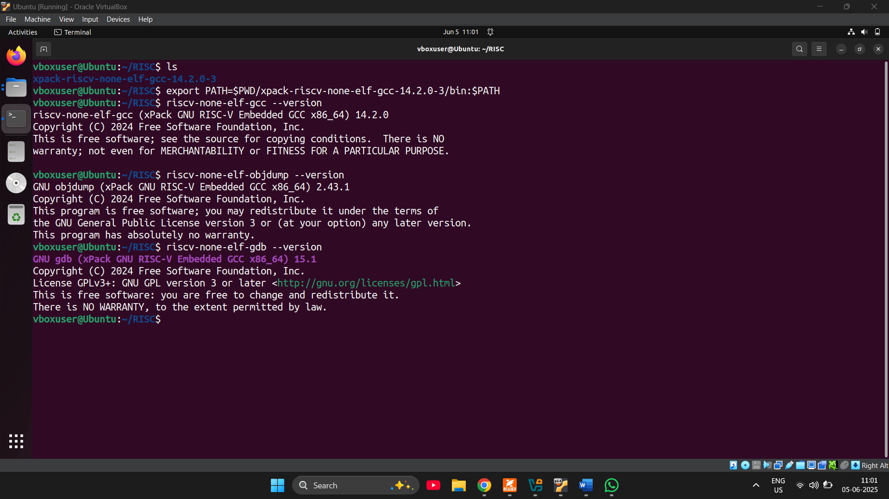

# Week 1: RISC-V Bare-Metal Toolchain & Debugging

This document outlines the tasks completed in Week 1 of the RISC-V SoC Lab, focusing on setting up the bare-metal RISC-V toolchain, cross-compiling, analyzing assembly, debugging, and understanding core RISC-V concepts.

## 1. RISC-V Toolchain Setup and Verification

This section details the process of unpacking the xPack RISC-V toolchain, adding it to the system's PATH, and verifying the functionality of `gcc`, `objdump`, and `gdb` binaries.

### Steps:
1. **Download the Toolchain**: Used `wget` to download the `xpack-riscv-none-elf-gcc` archive.
```bash
wget https://github.com/xpack-dev-tools/riscv-none-elf-gcc-xpack/releases/download/v14.2.0-3/xpack-riscv-none-elf-gcc-14.2.0-3-linux-x64.tar.gz
```

2. **Unpack the Archive**: Extracted the contents of the downloaded tarball, creating a folder named `xpack-riscv-none-elf-gcc-14.2.0-3`.
```bash
tar -xvzf xpack-riscv-none-elf-gcc-14.2.0-3-linux-x64.tar.gz
```

3. **Add the Toolchain to PATH (Temporarily)**: Added the toolchain binaries to the current session's PATH.
```bash
export PATH=$PWD/xpack-riscv-none-elf-gcc-14.2.0-3/bin:$PATH
```

4. **Check if Binaries Work**: Verified the functionality of `gcc`, `objdump`, and `gdb` by checking their versions.
```bash
riscv-none-elf-gcc --version
riscv-none-elf-objdump --version
riscv-none-elf-gdb --version
```

### Output:


*(Placeholder for your screenshot confirming toolchain versions)*

## 2. Minimal C "Hello World" Cross-Compilation for RV32IMC

This section demonstrates how to create a minimal bare-metal C "Hello, World!" program and cross-compile it for the RV32IMC architecture, producing an ELF binary.

### Files:
- **hello.c**: Minimal Bare-Metal Code
```c
// hello.c
int main() {
    volatile char *uart = (char *)0x10000000; // Memory-mapped UART address
    const char *msg = "Hello, World!\n";

    while (*msg) {
        *uart = *msg++; // Write each character to UART
    }
    return 0;
}

// Minimal _start (no C runtime)
void _start() {
    main();
    while (1); // Trap CPU after main returns
}
```

- **linker.ld**: Minimal Linker Script for RISC-V RV32IMC
```ld
/* linker.ld - Minimal linker script for RISC-V RV32IMC */
ENTRY(_start)
SECTIONS {
    . = 0x80000000; /* Code starts here */
    .text : {
        *(.text*)
    }
    .data : {
        *(.data*)
    }
    .bss : {
        *(.bss*)
        *(COMMON)
    }
}
```

Both files were saved in the same directory.

### Compile the ELF Binary:
The following command was used to cross-compile `hello.c` into an ELF executable using the specified RISC-V architecture and ABI.
```bash
riscv-none-elf-gcc hello.c -o hello.elf \
-march=rv32imc -mabi=ilp32 \
-nostartfiles -nostdlib -T linker.ld
```

### Verify the ELF:
Used `objdump` and `readelf` to verify the generated ELF file.
```bash
riscv-none-elf-objdump -d hello.elf
riscv-none-elf-readelf -h hello.elf | grep Entry
```

### Output:
The output confirmed `_start` in the disassembly and the entry point address.

*(Placeholder for your screenshot of ELF compilation and verification output)*

## 3. Generating .s File and Explaining Prologue/Epilogue

This section covers generating the assembly (`.s`) file from the C code and explaining the prologue and epilogue sequences of the `main` function.

### Step 1: Generate the .s File
The `-S` flag was used with `gcc` to generate the assembly output.
```bash
riscv-none-elf-gcc hello.c -S -o hello.s \
-march=rv32imc -mabi=ilp32 \
-nostartfiles -nostdlib -T linker.ld
```

### Step 2: Look at the Assembly (hello.s)
An example snippet of the `main` function assembly, illustrating stack allocation and register saving/restoring.
```assembly
main:
    addi    sp,sp,-32   # Allocate 32 bytes stack
    sw      ra,28(sp)   # Save return address
    sw      s0,24(sp)   # Save frame pointer
    addi    s0,sp,32    # Set up frame pointer (s0=old sp)
    # ... function body ...
    lw      ra,28(sp)   # Restore return address
    lw      s0,24(sp)   # Restore frame pointer
    addi    sp,sp,32    # Deallocate stack
    ret                 # Return
```

### Step 3: Explain Prologue and Epilogue
- **Prologue (Function Entry)**: Allocates stack space, saves the return address (`ra`), and the caller’s frame pointer (`s0`). Sets up the new frame pointer for safe function calls and variable isolation.
```assembly
addi    sp,sp,-32   # Allocate stack space
sw      ra,28(sp)   # Save return address
sw      s0,24(sp)   # Save frame pointer (s0)
addi    s0,sp,32    # Set new frame pointer
```

- **Epilogue (Function Exit)**: Restores the saved `ra` and `s0` registers, frees the allocated stack space, and returns control to the caller.
```assembly
lw      ra,28(sp)   # Restore return address
lw      s0,24(sp)   # Restore old frame pointer
addi    sp,sp,32    # Free stack space
ret                 # Return to caller
```

### Output:
*(Placeholder for your screenshot of assembly file generation output)*

## 4. Converting ELF to Raw Hex and Disassembly with Objdump

This section describes converting the ELF file into a raw binary or hex format and disassembling it using `objdump`, explaining the columns of the disassembly output.

### 1. Convert ELF to Raw Binary or Hex
- **Option A: Generate .bin (raw binary)**
```bash
riscv-none-elf-objcopy -O binary hello.elf hello.bin
```
This produces a flat binary without headers, suitable for direct memory loading.

- **Option B: Generate .hex (Intel HEX format)**
```bash
riscv-none-elf-objcopy -O ihex hello.elf hello.hex
```
This generates an Intel HEX file, often used by flash programmers.

### 2. Disassemble the ELF File
- **Basic disassembly**:
```bash
riscv-none-elf-objdump -d hello.elf
```

- **Disassembly with source code (if available)**:
```bash
riscv-none-elf-objdump -S hello.elf
```

### 3. Understanding the Disassembly Output
Example output:
```
80000000 <main>:
80000000: 1101          addi    sp,sp,-32
80000002: ce06          sw      ra,28(sp)
80000004: cc22          sw      s0,24(sp)
```
Each line contains:
- `80000000`: Address of the instruction in memory.
- `1101`: Machine code in hexadecimal.
- `addi sp,sp,-32`: Assembly instruction in human-readable form.

This output shows the exact encoding of each instruction and its location in memory.

### 4. View Binary Contents in Hex
The `hexdump` utility was used to inspect the raw binary contents.
```bash
hexdump -C hello.bin
```
This outputs hexadecimal and ASCII representations of the binary data.

### Output:
*(Placeholder for your screenshot of ELF to hex conversion and objdump output)*

## 5. RV32 Integer Registers and Calling Convention Roles

This section provides a complete list of the 32 integer registers in RV32I, along with their ABI names and conventional roles in the calling convention.

### RV32I Integer Register Table:
| Reg No | ABI Name | Role / Usage |
|--------|----------|--------------|
| x0     | zero     | Constant zero (hardwired, always 0) |
| x1     | ra       | Return address |
| x2     | sp       | Stack pointer |
| x3     | gp       | Global pointer |
| x4     | tp       | Thread pointer |
| x5     | t0       | Temporary register 0 |
| x6     | t1       | Temporary register 1 |
| x7     | t2       | Temporary register 2 |
| x8     | s0 / fp  | Saved register 0 / Frame pointer |
| x9     | s1       | Saved register 1 |
| x10    | a0       | Argument 0 / Return value |
| x11    | a1       | Argument 1 / Return value |
| x12    | a2       | Argument 2 |
| x13    | a3       | Argument 3 |
| x14    | a4       | Argument 4 |
| x15    | a5       | Argument 5 |
| x16    | a6       | Argument 6 |
| x17    | a7       | Argument 7 |
| x18    | s2       | Saved register 2 |
| x19    | s3       | Saved register 3 |
| x20    | s4       | Saved register 4 |
| x21    | s5       | Saved register 5 |
| x22    | s6       | Saved register 6 |
| x23    | s7       | Saved register 7 |
| x24    | s8       | Saved register 8 |
| x25    | s9       | Saved register 9 |
| x26    | s10      | Saved register 10 |
| x27    | s11      | Saved register 11 |
| x28    | t3       | Temporary register 3 |
| x29    | t4       | Temporary register 4 |
| x30    | t5       | Temporary register 5 |
| x31    | t6       | Temporary register 6 |

### Calling Convention Summary:
- **Caller-saved**: `a0–a7`, `t0–t6`. These registers may be overwritten by a called function. The caller must save them before the call if preservation is needed.
- **Callee-saved**: `s0–s11`. These registers must be preserved by the called function across calls.
- **Special-purpose**:
  - `x0` (zero): Always returns 0.
  - `x1` (ra): Stores the return address from a function call.
  - `x2` (sp): Points to the top of the stack.
  - `x8` (s0/fp): Often used as the frame pointer for stack frames.

## 6. Debugging with riscv32-unknown-elf-gdb

This section demonstrates how to start `riscv32-unknown-elf-gdb` on an ELF, set a breakpoint, step through code, and inspect registers.

### Compile:
The `hello2.c` and `linker.ld` files were compiled to `hello2.elf`.
```bash
riscv-none-elf-gcc -march=rv32im -mabi=ilp32 -nostdlib -T linker.ld -o hello2.elf hello2.c
```

### Verify ELF:
```bash
riscv-none-elf-readelf -h hello2.elf
```

### Debug with GDB:
```bash
riscv-none-elf-gdb hello2.elf
(gdb) set breakpoint auto-hw off
(gdb) target sim
(gdb) load
(gdb) break main
(gdb) run
(gdb) step
(gdb) stepi
(gdb) info registers
(gdb) step
(gdb) print x
(gdb) print $a0
(gdb) continue
(gdb) quit
```

### Output:
*(Placeholder for your first screenshot of GDB debugging, showing initial setup and breakpoint)*  
*(Placeholder for your second screenshot of GDB debugging, showing register inspection)*

## 7. Booting Bare-Metal ELF with QEMU and UART Output

This section provides the QEMU command to boot a bare-metal ELF and print output to the UART console.

### 1. Compile:
The `hello2.c` and `startup.s` files were compiled to `hello2.elf`.
```bash
riscv-none-elf-gcc -g -march=rv32im -mabi=ilp32 -nostdlib -T linker.ld -o hello2.elf hello2.c startup.s
```

### 2. Verify ELF:
```bash
riscv-none-elf-readelf -h hello2.elf
riscv-none-elf-readelf -l hello2.elf
```
Confirmed: Machine: RISC-V, Class: ELF32, Entry point address: 0x80000000. Ensured `.text` and `.rodata` in FLASH with `R E` flags, and `.data` and `.bss` in RAM with `R W` flags.

### 3. Run with QEMU:
```bash
qemu-system-riscv32 -nographic -machine virt -bios none -kernel ~/RISC/Projects/Week1/uart/hello2.elf
```

### Expected Output:
```
Printing from UART
Value of x: 43
```

### Output:
*(Placeholder for your first screenshot of QEMU UART output)*  
*(Placeholder for your second screenshot of QEMU UART output)*

## 8. Compiler Optimization (-O0 vs. -O2) Analysis

This section compares the assembly differences when compiling with `-O0` (no optimization) versus `-O2` (optimization level 2) and explains why these differences occur.

### 1. Navigate to Directory:
```bash
cd ~/RISC/Projects/Week1/uart
```

### 2. Compile with -O0 (No Optimization):
- **Generate the ELF**:
```bash
riscv-none-elf-gcc -g -O0 -march=rv32im -mabi=ilp32 -nostdlib -T linker.ld -o hello2_O0.elf hello2.c startup.s
```

- **Generate assembly**:
```bash
riscv-none-elf-gcc -g -O0 -march=rv32im -mabi=ilp32 -nostdlib -S -o hello2_O0.s hello2.c
```

### 3. Compile with -O2 (Optimization Level 2):
- **Generate the ELF**:
```bash
riscv-none-elf-gcc -g -O2 -march=rv32im -mabi=ilp32 -nostdlib -T linker.ld -o hello2_O2.elf hello2.c startup.s
```

- **Generate assembly**:
```bash
riscv-none-elf-gcc -g -O2 -march=rv32im -mabi=ilp32 -nostdlib -S -o hello2_O2.s hello2.c
```

### 4. Verify Compilation:
```bash
riscv-none-elf-readelf -h hello2_O0.elf
riscv-none-elf-readelf -h hello2_O2.elf
```

### 5. Run the ELFs to Confirm Functionality:
```bash
qemu-system-riscv32 -nographic -machine virt -bios none -kernel ~/RISC/Projects/Week1/uart/hello2_O0.elf
qemu-system-riscv32 -nographic -machine virt -bios none -kernel ~/RISC/Projects/Week1/uart/hello2_O2.elf
```

### Expected Output for Both:
```
Value of x: 43
```

### Differences and Why They Occur:
- **Stack Frame Size**:
  - `-O0`: Allocates a larger 48-byte stack frame.
  - `-O2`: Uses a smaller 16-byte stack frame.
  - **Why**: `-O0` prioritizes debuggability by storing all variables on the stack. `-O2` minimizes stack usage by keeping variables in registers.
- **Variable Storage**:
  - `-O0`: Stores variables (e.g., `x` and `i`) on the stack with frequent loads/stores.
  - `-O2`: Keeps variables in registers, avoiding stack access.
  - **Why**: `-O0` avoids register optimization for debugging. `-O2` uses registers to reduce memory access latency.
- **Instruction Count**:
  - `-O0`: More instructions due to redundant loads/stores and verbose stack management.
  - `-O2`: Fewer instructions by eliminating redundant operations.
  - **Why**: `-O0` translates C code literally. `-O2` applies optimizations like register allocation and dead code elimination.
- **Loop Efficiency**:
  - `-O0`: Stack-based addressing and repeated loads for loop variables.
  - `-O2`: Uses a single stack slot for buffers and keeps variables in registers, reducing memory operations.
  - **Why**: `-O2` optimizes loops by minimizing memory accesses and reusing registers.
- **Function Calls**:
  - `-O0`: Explicit calls with full stack frame setup.
  - `-O2`: Similar calls, but surrounding code is optimized.
  - **Why**: `-O0` avoids inlining to preserve function boundaries for debugging. `-O2` could inline small functions but might keep others separate due to complexity.
- **Debug Information**:
  - `-O0`: Includes detailed debug info, making tracing easier.
  - `-O2`: Retains some debug info, but optimized code may complicate debugging.
  - **Why**: `-O0` is designed for debugging. `-O2` prioritizes performance.

### Output:
*(Placeholder for your first screenshot comparing -O0 and -O2 ELF/assembly generation)*  
*(Placeholder for your second screenshot comparing -O0 and -O2 QEMU outputs)*

## 9. Reading Cycle Counter using Inline Assembly (CSR 0xC00)

This section details writing a C function to return the cycle counter by reading CSR 0xC00 using inline assembly, and explains each constraint.

### Compilation and Testing:
Save Files: `hello2.c`, `startup.s`, and `linker.ld` were saved.
```bash
cd ~/RISC/Projects/Week1/uart
```

### Compile:
```bash
riscv-none-elf-gcc -g -O0 -march=rv32im -mabi=ilp32 -nostdlib -T linker.ld -o hello2.elf hello2.c startup.s
```

### Run in QEMU:
```bash
qemu-system-riscv32 -nographic -machine virt -bios none -kernel ~/RISC/Projects/Week1/uart/hello2.elf
```

### Expected Output:
```
Value of x: 43
Cycles taken: <some number>
```

### Inline Assembly Breakdown:
The inline assembly statement used is:
```c
__asm__ volatile (
    "rdcycle %0"
    : "=r" (cycles)
    :
    :
);
```

- **Assembly Template**: `"rdcycle %0"`
  - `rdcycle`: Reads the CYCLE CSR (0xC00) into a register.
  - `%0`: Placeholder for the output operand (`cycles`).
- **Output Constraint**: `"=r" (cycles)`
  - `=`: Indicates the operand is write-only.
  - `r`: Specifies a general-purpose register. The compiler allocates a register to store the result.
  - `(cycles)`: Binds the result to the C variable `cycles` (a `uint32_t`). After execution, the value in the allocated register is copied to `cycles`.
  - **Purpose**: Ensures the cycle count is stored in the `cycles` variable.
- **Input Constraints**: (empty)
  - **Explanation**: `rdcycle` does not require input operands as it directly reads the CSR.
  - **Purpose**: Indicates the instruction operates independently of C-level inputs.
- **Clobbered Registers**: (empty)
  - **Explanation**: No additional registers are modified (clobbered) by `rdcycle` beyond the output register.
  - **Purpose**: Informs the compiler that no registers need to be saved/restored, simplifying code generation.
- **`__asm__ volatile`**:
  - `__asm__`: GCC keyword for inline assembly.
  - `volatile`: Prevents the compiler from optimizing away the assembly.
  - **Purpose**: Ensures the `rdcycle` instruction is executed exactly as written.

### Output:
*(Placeholder for your screenshot of cycle counter output)*

## 10. GPIO Register Toggling and Compiler Optimization Prevention

This section outlines a bare-metal C snippet to toggle a GPIO register at `0x10012000` and explains how to prevent the compiler from optimizing away the store operations.

### Compilation and Testing:
Save Files: `gpio_toggle.c`, `startup.s`, and `linker.ld` were saved.
```bash
cd ~/RISC/Projects/Week1/uart
```

### Compile:
```bash
riscv-none-elf-gcc -g -O2 -march=rv32im -mabi=ilp32 -nostdlib -T linker.ld -o gpio_toggle.elf gpio_toggle.c startup.s
```

### Verify ELF:
```bash
riscv-none-elf-readelf -h gpio_toggle.elf
```
Confirmed: Machine: RISC-V, Class: ELF32, Entry point address: 0x80000000.

### Run in QEMU:
```bash
qemu-system-riscv32 -nographic -machine virt -bios none -kernel ~/RISC/Projects/Week1/uart/gpio_toggle.elf
```

### Expected Output:
```
GPIO Toggled .......... (dots continue)
```

### Test with Spike:
```bash
spike --isa=rv32im ~/RISC/Projects/Week1/uart/gpio_toggle.elf
```

### Expected Output:
```
A, GPIO Toggled, B, dots
```

### Bare-Metal C Snippet to Toggle GPIO:
```c
// gpio_toggle.c
volatile unsigned int *GPIO_REGISTER = (volatile unsigned int *)0x10012000; // GPIO address

int main() {
    // Example: Toggle a bit on the GPIO register
    for (int i = 0; i < 10; ++i) {
        *GPIO_REGISTER = 1; // Set GPIO High
        // Add a delay here if needed for observation
        *GPIO_REGISTER = 0; // Set GPIO Low
        // Add a delay here if needed for observation
    }
    return 0;
}

void _start() {
    main();
    while(1);
}
```
Using `volatile` ensures that every read and write to `GPIO_REGISTER` is performed and not optimized away by the compiler, critical for interacting with hardware registers.

### Output:
*(Placeholder for your screenshot of the GPIO toggling output from QEMU/Spike)*

## 11. Minimal Linker Script with Specific Section Placement

This section provides a minimal linker script that places the `.text` section at `0x00000000` and the `.data` section at `0x10000000` for RV32IMC.

### Linker Script (link.ld):
```ld
/* link.ld - Minimal linker script for custom memory layout */
ENTRY(_start)

SECTIONS {
    .text 0x00000000 : { /* .text at address 0x00000000 */
        *(.text*)
    }

    .data 0x10000000 : { /* .data at address 0x10000000 */
        *(.data*)
    }

    .bss (NOLOAD) : {
        *(.bss*)
        *(COMMON)
    }
}
```

### Compile Command:
```bash
riscv-none-elf-gcc -march=rv32imc -mabi=ilp32 \
-nostdlib -nostartfiles -T link.ld \
_start.s hello.c -o hello.elf
```
Ensure `_start.s` contains the `_start` label, sets up the stack, and jumps to `main`.

## 12. Understanding crt0.S in Bare-Metal RISC-V

This section explains the role of `crt0.S` (C runtime zero) in a bare-metal RISC-V program and its typical tasks.

### What crt0.S Typically Does:
`crt0.S` is the first assembly file executed after a RISC-V processor resets. It sets up the execution environment before `main()` is called, crucial when a full C library like `newlib` or `glibc` is not used.

| Step | Task |
|------|------|
| 1    | Set up the stack pointer (sp) |
| 2    | Initialize .bss (zero out uninitialized data) |
| 3    | Optionally copy .data from flash to RAM |
| 4    | Call the main() function |
| 5    | Handle main() return (often enters an infinite loop or triggers an exit routine) |

## 13. Enabling Machine-Timer Interrupt (MTIP) and Simple Handler

This section demonstrates how to enable the Machine-Timer Interrupt (MTIP) and write a simple handler in C/assembly.

### Compilation and Testing:
Save Files: `timer_interrupt.c`, `trap_handler.s`, `startup.s`, and `linker.ld` were saved.
```bash
cd ~/RISC/Projects/Week1/MTIP
```

### Compile:
```bash
riscv-none-elf-gcc -g -O2 -march=rv32imc_zicsr -mabi=ilp32 -nostdlib -T linker.ld -o timer.elf timer_interrupt.c trap_handler.s startup.s
```

### Verify ELF:
```bash
riscv-none-elf-readelf -h timer.elf
```
Confirmed Entry point: 0x80000000.

### Run in QEMU:
```bash
qemu-system-riscv32 -nographic -machine virt -bios none -kernel timer.elf
```

### Expected Output:
```
S A Timer enabled .MTIP .MTIP ... (MTIP every ~1s, dots continue)
```

### Output:
*(Placeholder for your screenshot of MTIP output)*

## 14. Explanation of the 'A' (Atomic) Extension in RV32IMAC

This section explains the 'A' (Atomic) extension in the RISC-V RV32IMAC instruction set architecture, the instructions it adds, and their usefulness.

### Overview of the 'A' Extension:
- **Purpose**: Provides instructions for atomic memory operations, crucial for synchronization in concurrent environments like multi-core processors or operating systems.
- **Base ISA**: RV32IMAC includes the 32-bit base integer (I), multiply-divide (M), atomic (A), and compressed (C) extensions. The 'A' extension adds atomic instructions to RV32I.
- **Atomicity**: Atomic operations ensure a sequence of memory accesses (e.g., read-modify-write) is performed as a single, uninterruptible unit, preventing race conditions when multiple hardware threads (harts) access shared memory.
- **Context**: Useful for implementing locks, semaphores, or shared data structures in bare-metal or OS code in the lab environment.

### Instructions Added by the 'A' Extension:
The 'A' extension introduces two main categories: Load-Reserved/Store-Conditional (LR/SC) and Atomic Memory Operations (AMO).

#### Load-Reserved/Store-Conditional (LR/SC):
- `lr.w rd, (rs1)` (Load-Reserved Word): Loads a 32-bit word from `rs1` into `rd` and establishes a reservation on the memory address.
- `sc.w rd, rs2, (rs1)` (Store-Conditional Word): Attempts to store `rs2` to `rs1`. Succeeds (writes 0 to `rd`) only if the reservation is valid. Fails (writes non-zero to `rd`) if another hart modified the address.
- **Mechanism**: LR/SC forms a pair for atomic read-modify-write. The reservation ensures the location remains unchanged between `lr.w` and `sc.w`. If another hart writes to the reserved address, `sc.w` fails.
- **Constraints**: Must operate on naturally aligned 32-bit addresses. Code between `lr.w` and `sc.w` should be minimal.

#### Atomic Memory Operations (AMO):
These instructions perform a read-modify-write operation atomically in a single step, returning the original value in `rd`:
- `amoadd.w rd, rs2, (rs1)`: Atomic Add
- `amoswap.w rd, rs2, (rs1)`: Atomic Swap
- `amoand.w rd, rs2, (rs1)`: Atomic AND
- `amoor.w rd, rs2, (rs1)`: Atomic OR
- `amoxor.w rd, rs2, (rs1)`: Atomic XOR
- `amomin.w rd, rs2, (rs1)`: Atomic Minimum
- `amomax.w rd, rs2, (rs1)`: Atomic Maximum
- `amominu.w rd, rs2, (rs1)`: Atomic Unsigned Minimum
- `amomaxu.w rd, rs2, (rs1)`: Atomic Unsigned Maximum
- **Constraints**: Operate on 32-bit aligned addresses and are performed atomically by hardware.

### Why These Instructions Are Useful:
- **Synchronization**: Essential for implementing synchronization primitives like locks, mutexes, and semaphores in multi-core systems. For example, `lr.w/sc.w` can implement a spinlock.
- **Data Consistency**: Prevent race conditions when multiple harts access shared variables (e.g., counters, queues). `amoadd.w` can atomically increment a shared counter.
- **Efficiency**: AMOs perform complex operations in one instruction, reducing software overhead. LR/SC allows flexible atomic operations with minimal hardware complexity.
- **Scalability**: In multi-core SoCs, atomic instructions ensure scalable synchronization without relying on global bus locks, which degrade performance.
- **Use Cases**: Operating systems (thread scheduling, resource allocation), bare-metal (coordinating harts), atomic counters, lock-free data structures, interrupt-safe updates.

## 15. Two-Thread Mutex Example using LR/SC on RV32

This section provides a two-thread mutex example using Load-Reserved/Store-Conditional (LR/SC) on RV32.

### Compilation and Testing:
Save Files: `mutex_example.c`, `startup.s`, and `linker.ld` were saved.
```bash
cd ~/RISC/Projects/Week1
```

### Compile:
```bash
riscv-none-elf-gcc -g -O2 -march=rv32imac_zicsr -mabi=ilp32 -nostdlib -T linker.ld -o mutex.elf mutex_example.c startup.s
```
Uses `rv32imac_zicsr` to include 'A' and CSR instructions.

### Verify ELF:
```bash
riscv-none-elf-readelf -h mutex.elf
```
Confirmed Entry point: 0x80000000.

### Run in QEMU:
```bash
qemu-system-riscv32 -nographic -machine virt -bios none -kernel mutex.elf
```

### Expected Output:
```
S A Starting threads
T1: Enter critical section
T1: Counter = 1
T1: Exit critical section
T2: Enter critical section
T2: Counter = 2
T2: Exit critical section
T1: Enter critical section
T1: Counter = 3
T1: Exit critical section
T2: Enter critical section
T2: Counter = 4
T2: Exit critical section
Done .......... (dots continue)
```

### Output:
*(Placeholder for your screenshot of the mutex example output)*

## 16. Retargeting _write for printf to UART

This section explains how to retarget the `_write` function so that `printf` sends bytes to a memory-mapped UART at `0x10000000`.

### Purpose:
To redirect `printf` output to a custom UART hardware in a bare-metal RISC-V environment. The `_write` function is a low-level I/O hook used by the C standard library.

### The printf Output Chain:
- `printf` (High-Level Formatting): Handles formatting (e.g., "Hello, %s!").
- Calls `fputc` (or similar): Processes each character.
- Calls `_write` (Low-Level Hook): This is the function to be customized.
- Custom `_write` Implementation: Interacts with the specific UART hardware (e.g., writing to `0x10000000` after checking a status register at `0x10000005`, bit 5 for TX ready).

### Example _write Implementation:
```c
#include <stdint.h>
#include <unistd.h> // For ssize_t, size_t

// Memory-mapped UART Data Register
volatile uint32_t *const UART_DR = (volatile uint32_t *)0x10000000;
// Memory-mapped UART Status Register (assuming bit 5 is TX_READY)
volatile uint32_t *const UART_SR = (volatile uint32_t *)0x10000005;

#define UART_SR_TX_READY (1 << 5)

// _write function for newlib
ssize_t _write(int file, const void *ptr, size_t len) {
    // Only handle stdout and stderr
    if (file == STDOUT_FILENO || file == STDERR_FILENO) {
        const char *buf = (const char *)ptr;
        for (size_t i = 0; i < len; ++i) {
            // Wait until UART is ready to transmit
            while (!(*UART_SR & UART_SR_TX_READY)); // Polling for TX ready
            *UART_DR = buf[i]; // Write character to UART data register
        }
        return len; // Indicate success by returning the number of bytes written
    }
    return -1; // Indicate error for other file descriptors
}
```

By implementing `_write` this way, any call to `printf` will direct its output characters to the specified memory-mapped UART register.


